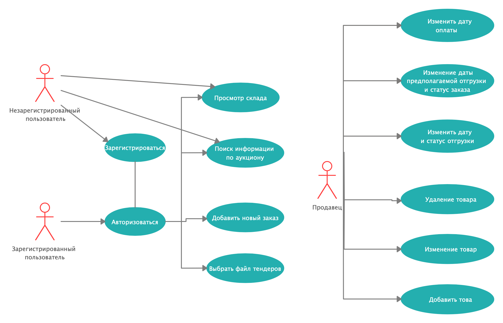
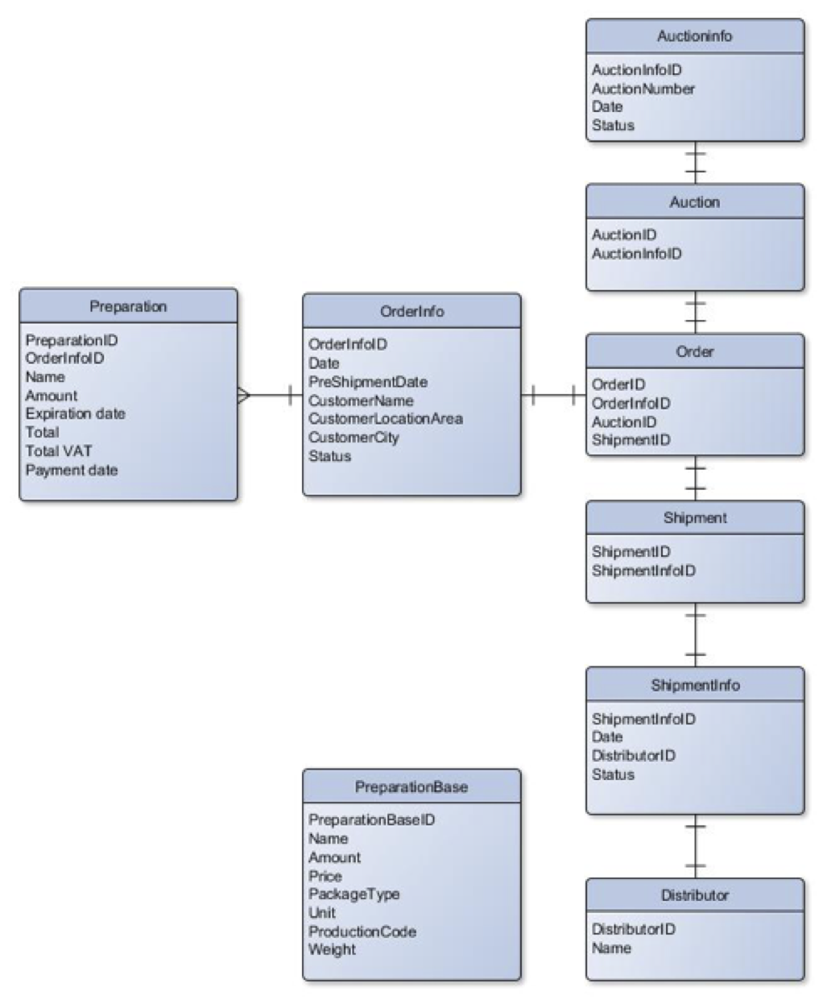
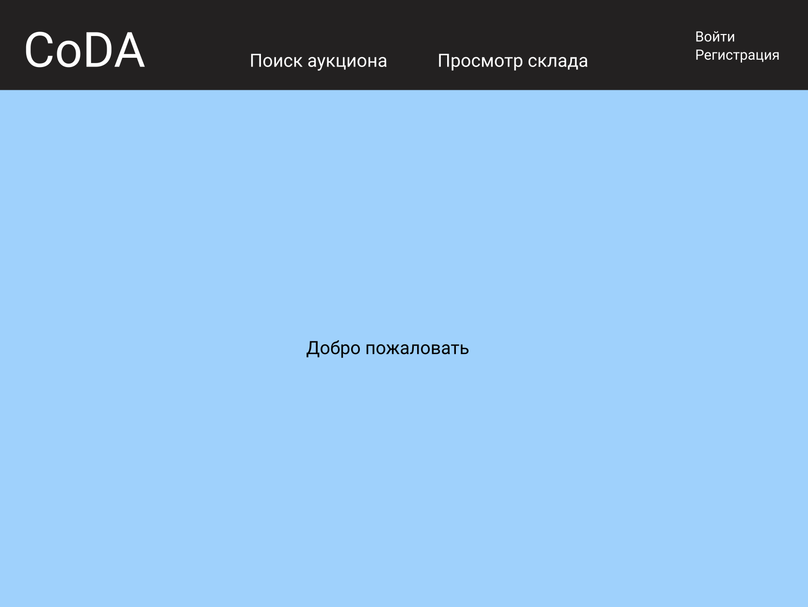

Проект CoDA
----
**Краткое описание проблемной области и актуальности**

Сервис представляет собой систему взаимодействия между дистрибьютерами и производителями товаров. Его главная задача - повышение эффективности и результатиивности публичных закупок в российских публичных аукционах в сфере медицинских препаратов.
Он позволит урегулировать поток заявок от дистрибьютеров путем контроля учета товара, начиная с самого первого этапа - размещения заявки и заканчивая отгрузкой конечному получателю. В результате сервсис будет представлять из себя передовую модель CRM системы с интегрированной в неё базы данных.

**Описание ролей пользователя**

*Use-Case диаграмма*

**Сущности**

*Структура базы данных*

**Прототип интерфейса**

*Главная страница:*

*Вход в акаунт:*

*Станица поиска аукциона:*

*Страница выбора файла тендеров:*

*Страница добавления нового заказа:*

*Страница просмотра скалада:*

**Архитектура приложения**

**Технические детали реализации**

*Состав:*

Мороков ИУ7-75 (@mml16u386) - backend

Михеев ИУ7-71 (@mva16u385) - frontend

*Стек:*

Beckend: C# ASP.NET (ASP .NET MVC), MSSQL

Frontend: HTML+JS

**Подход к CI/CD**

Сборка докера и прогон тестов.
